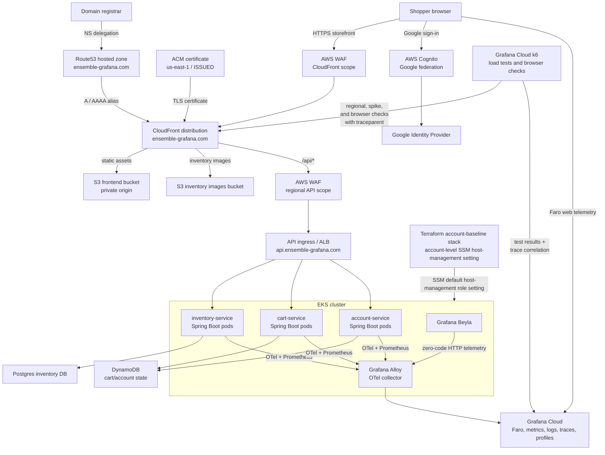
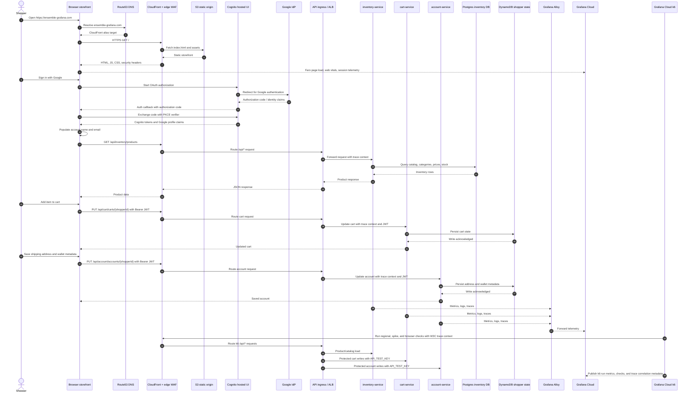
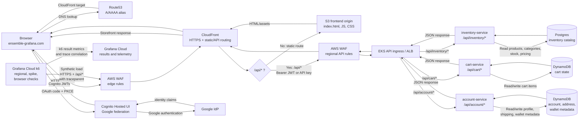
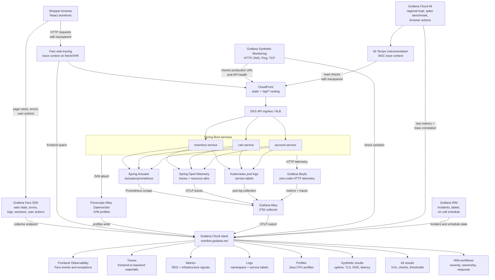

# Ensemble-Grafana Diagrams

Architecture diagrams for the Ensemble-Grafana ecommerce platform.

Rendered PNG exports are stored in `docs/diagrams/`. Source Mermaid blocks remain authoritative; regenerate PNGs after editing this file.

## Network Diagram

## Sequence Diagram

## Request Flow Diagram

## Observability Capabilities Flow

