# Ensemble-Grafana Diagrams

Architecture diagrams for the Ensemble-Grafana ecommerce platform.

Graphviz DOT sources are authoritative. Rendered SVG and PNG exports are stored in `docs/diagrams/`.

Regenerate exports after editing a DOT file:

```sh
for f in docs/diagrams/*.dot; do
  dot -Tsvg "$f" > "${f%.dot}.svg"
  dot -Tpng -Gdpi=192 "$f" > "${f%.dot}.png"
done
```

## Network Diagram

Source: `docs/diagrams/network-diagram.dot`

Rendered: [SVG](docs/diagrams/network-diagram.svg) · [PNG](docs/diagrams/network-diagram.png)

```dot
digraph network_diagram {
  rankdir=LR;
  label="Ensemble-Grafana Network Diagram";

  graph [
    fontname="Helvetica",
    fontsize=20,
    labelloc=t,
    bgcolor="white",
    pad=0.25,
    nodesep=0.45,
    ranksep=0.7
  ];
  node [
    shape=box,
    style="rounded,filled",
    fontname="Helvetica",
    fontsize=11,
    color="#334155",
    fillcolor="#f8fafc",
    margin="0.12,0.08"
  ];
  edge [
    fontname="Helvetica",
    fontsize=9,
    color="#475569",
    fontcolor="#334155",
    arrowsize=0.7
  ];


  shopper [label="Shopper browser", fillcolor="#dbeafe"];
  registrar [label="Domain registrar"];
  route53 [label="Route53 hosted zone\nensemble-grafana.com", fillcolor="#e0f2fe"];
  acm [label="ACM certificate\nus-east-1 / ISSUED", fillcolor="#ecfeff"];
  edgeWaf [label="AWS WAF\nCloudFront scope", fillcolor="#fee2e2"];
  cloudfront [label="CloudFront distribution\nensemble-grafana.com", fillcolor="#dbeafe"];
  staticS3 [label="S3 frontend bucket\nprivate origin", fillcolor="#fef3c7"];
  imageS3 [label="S3 inventory images bucket", fillcolor="#fef3c7"];
  logsS3 [label="S3 edge/API logs bucket\nCloudFront + ALB logs", fillcolor="#fef3c7"];
  regionalWaf [label="AWS WAF\nregional API scope", fillcolor="#fee2e2"];
  apiAlb [label="API ingress / ALB\napi.ensemble-grafana.com", fillcolor="#e0e7ff"];
  cognito [label="AWS Cognito\nGoogle federation", fillcolor="#ede9fe"];
  google [label="Google Identity Provider", fillcolor="#ede9fe"];
  postgres [label="Postgres inventory DB", shape=cylinder, fillcolor="#dcfce7"];
  dynamodb [label="DynamoDB\ncart/account state", shape=cylinder, fillcolor="#dcfce7"];
  cloudwatch [label="AWS CloudWatch\nRDS metrics", fillcolor="#f1f5f9"];
  cloudwatchScrape [label="Grafana Cloud Provider\nAWS/RDS scrape job", fillcolor="#faf5ff"];
  grafana [label="Grafana Cloud\nFaro, metrics, logs, traces, profiles", fillcolor="#f3e8ff"];
  k6 [label="Grafana Cloud k6\nload tests and browser checks", fillcolor="#f3e8ff"];
  accountBaseline [label="Terraform account-baseline stack\nSSM host-management setting", fillcolor="#e2e8f0"];

  subgraph cluster_eks {
    label="EKS cluster";
    color="#94a3b8";
    style="rounded,dashed";
    beyla [label="Grafana Beyla", fillcolor="#faf5ff"];
    alloy [label="Grafana Alloy\nOTel collector", fillcolor="#faf5ff"];
    inventory [label="inventory-service\nSpring Boot pods", fillcolor="#dcfce7"];
    cart [label="cart-service\nSpring Boot pods", fillcolor="#dcfce7"];
    account [label="account-service\nSpring Boot pods", fillcolor="#dcfce7"];
  }

  registrar -> route53 [label="NS delegation"];
  route53 -> cloudfront [label="A / AAAA alias"];
  acm -> cloudfront [label="TLS certificate"];
  shopper -> edgeWaf [label="HTTPS storefront"];
  edgeWaf -> cloudfront;
  shopper -> cognito [label="Google sign-in"];
  cognito -> google;
  cloudfront -> staticS3 [label="static assets"];
  cloudfront -> imageS3 [label="inventory images"];
  cloudfront -> logsS3 [label="standard access logs"];
  cloudfront -> regionalWaf [label="/api/*"];
  regionalWaf -> apiAlb;
  apiAlb -> logsS3 [label="ALB access logs"];
  apiAlb -> inventory;
  apiAlb -> cart;
  apiAlb -> account;
  inventory -> postgres;
  cart -> dynamodb;
  account -> dynamodb;
  postgres -> cloudwatch [label="RDS metrics"];
  cloudwatchScrape -> cloudwatch [label="assume AWS role\nand scrape metrics"];
  cloudwatchScrape -> grafana [label="CloudWatch metrics"];
  shopper -> grafana [label="Faro web telemetry"];
  accountBaseline -> beyla [label="SSM default role setting"];
  k6 -> cloudfront [label="regional, spike, browser checks\nwith traceparent"];
  k6 -> grafana [label="test results + trace correlation"];
  beyla -> alloy [label="zero-code HTTP telemetry"];
  inventory -> alloy [label="OTel + Prometheus"];
  cart -> alloy [label="OTel + Prometheus"];
  account -> alloy [label="OTel + Prometheus"];
  alloy -> grafana;
}
```



## Sequence Diagram

Source: `docs/diagrams/sequence-diagram.dot`

Rendered: [SVG](docs/diagrams/sequence-diagram.svg) · [PNG](docs/diagrams/sequence-diagram.png)

```dot
digraph sequence_diagram {
  rankdir=TB;
  label="Frontend-to-Backend Sequence";

  graph [
    fontname="Helvetica",
    fontsize=20,
    labelloc=t,
    bgcolor="white",
    pad=0.25,
    nodesep=0.45,
    ranksep=0.7
  ];
  node [
    shape=box,
    style="rounded,filled",
    fontname="Helvetica",
    fontsize=11,
    color="#334155",
    fillcolor="#f8fafc",
    margin="0.12,0.08"
  ];
  edge [
    fontname="Helvetica",
    fontsize=9,
    color="#475569",
    fontcolor="#334155",
    arrowsize=0.7
  ];

  node [shape=box, style="rounded,filled", fontname="Helvetica", fontsize=10, color="#334155", fillcolor="#f8fafc"];

  start [label="1. Shopper opens https://ensemble-grafana.com", fillcolor="#dbeafe"];
  dns [label="2. Browser resolves Route53 alias to CloudFront", fillcolor="#e0f2fe"];
  static [label="3. CloudFront + edge WAF fetch storefront from S3", fillcolor="#fef3c7"];
  faro [label="4. Browser sends Faro page load, vitals, session telemetry", fillcolor="#f3e8ff"];
  signin [label="5. Shopper starts Google sign-in", fillcolor="#ede9fe"];
  oauth [label="6. Cognito redirects to Google and exchanges code with PKCE", fillcolor="#ede9fe"];
  accountPopulate [label="7. Browser receives Cognito tokens and populates account name/email", fillcolor="#dbeafe"];
  products [label="8. Browser GET /api/inventory/products through CloudFront", fillcolor="#dbeafe"];
  inventory [label="9. ALB forwards to inventory-service with trace context", fillcolor="#dcfce7"];
  postgres [label="10. inventory-service queries Postgres catalog", shape=cylinder, fillcolor="#bbf7d0"];
  cartAdd [label="11. Shopper adds item: PUT /api/cart/carts/{shopperId}", fillcolor="#dbeafe"];
  cart [label="12. cart-service persists cart state to DynamoDB", fillcolor="#dcfce7"];
  dynamoCart [label="13. DynamoDB acknowledges cart write", shape=cylinder, fillcolor="#bbf7d0"];
  accountSave [label="14. Shopper saves shipping address and wallet metadata", fillcolor="#dbeafe"];
  account [label="15. account-service persists profile, address, wallet metadata", fillcolor="#dcfce7"];
  dynamoAccount [label="16. DynamoDB acknowledges account write", shape=cylinder, fillcolor="#bbf7d0"];
  telemetry [label="17. Services emit metrics, logs, traces to Alloy", fillcolor="#f3e8ff"];
  grafana [label="18. Alloy and Faro forward telemetry to Grafana Cloud", fillcolor="#f3e8ff"];
  k6 [label="19. Grafana Cloud k6 runs regional, spike, browser checks", fillcolor="#f3e8ff"];
  k6Results [label="20. k6 publishes run metrics, checks, trace correlation", fillcolor="#f3e8ff"];

  start -> dns -> static -> faro -> signin -> oauth -> accountPopulate -> products -> inventory -> postgres -> cartAdd -> cart -> dynamoCart -> accountSave -> account -> dynamoAccount -> telemetry -> grafana -> k6 -> k6Results;

  subgraph cluster_participants {
    label="Key participants";
    color="#cbd5e1";
    style="rounded,dashed";
    p1 [label="Browser / Shopper", fillcolor="#dbeafe"];
    p2 [label="Route53 / CloudFront / S3", fillcolor="#fef3c7"];
    p3 [label="Cognito / Google IdP", fillcolor="#ede9fe"];
    p4 [label="ALB / Spring services", fillcolor="#dcfce7"];
    p5 [label="Postgres / DynamoDB", shape=cylinder, fillcolor="#bbf7d0"];
    p6 [label="Alloy / Grafana / k6", fillcolor="#f3e8ff"];
    p1 -> p2 -> p3 -> p4 -> p5 -> p6 [style=invis];
  }
}
```



## Request Flow Diagram

Source: `docs/diagrams/request-flow-diagram.dot`

Rendered: [SVG](docs/diagrams/request-flow-diagram.svg) · [PNG](docs/diagrams/request-flow-diagram.png)

```dot
digraph request_flow_diagram {
  rankdir=LR;
  label="Browser Request Flow Through Backend Services";

  graph [
    fontname="Helvetica",
    fontsize=20,
    labelloc=t,
    bgcolor="white",
    pad=0.25,
    nodesep=0.45,
    ranksep=0.7
  ];
  node [
    shape=box,
    style="rounded,filled",
    fontname="Helvetica",
    fontsize=11,
    color="#334155",
    fillcolor="#f8fafc",
    margin="0.12,0.08"
  ];
  edge [
    fontname="Helvetica",
    fontsize=9,
    color="#475569",
    fontcolor="#334155",
    arrowsize=0.7
  ];


  browser [label="Browser\nensemble-grafana.com", fillcolor="#dbeafe"];
  dns [label="Route53\nA/AAAA alias", fillcolor="#e0f2fe"];
  wafEdge [label="AWS WAF\nedge rules", fillcolor="#fee2e2"];
  cf [label="CloudFront\nHTTPS + static/API routing", fillcolor="#dbeafe"];
  apiPath [label="/api/* ?", shape=diamond, fillcolor="#fff7ed"];
  s3 [label="S3 frontend origin\nindex.html, JS, CSS", fillcolor="#fef3c7"];
  cognito [label="Cognito Hosted UI\nGoogle federation", fillcolor="#ede9fe"];
  google [label="Google IdP", fillcolor="#ede9fe"];
  apiWaf [label="AWS WAF\nregional API rules", fillcolor="#fee2e2"];
  ingress [label="EKS API ingress / ALB", fillcolor="#e0e7ff"];
  k6 [label="Grafana Cloud k6\nregional, spike, browser checks", fillcolor="#f3e8ff"];
  grafana [label="Grafana Cloud\nresults and telemetry", fillcolor="#f3e8ff"];

  inventory [label="inventory-service\n/api/inventory/*", fillcolor="#dcfce7"];
  cart [label="cart-service\n/api/cart/*", fillcolor="#dcfce7"];
  account [label="account-service\n/api/account/*", fillcolor="#dcfce7"];
  postgres [label="Postgres\ninventory catalog", shape=cylinder, fillcolor="#bbf7d0"];
  dynamoCart [label="DynamoDB\ncart state", shape=cylinder, fillcolor="#bbf7d0"];
  dynamoAccount [label="DynamoDB\naccount, address, wallet metadata", shape=cylinder, fillcolor="#bbf7d0"];

  browser -> dns [label="DNS lookup"];
  dns -> browser [label="CloudFront target"];
  browser -> wafEdge [label="HTTPS request"];
  browser -> cognito [label="OAuth code + PKCE"];
  cognito -> google [label="Google authentication"];
  google -> cognito [label="identity claims"];
  cognito -> browser [label="Cognito JWTs"];
  k6 -> wafEdge [label="Synthetic load\nHTTPS + /api/*\nwith traceparent"];
  wafEdge -> cf;
  cf -> apiPath;
  apiPath -> s3 [label="No: static route"];
  s3 -> cf [label="HTML/assets"];
  cf -> browser [label="Storefront response"];

  apiPath -> apiWaf [label="Yes: /api/*\nBearer JWT or API key"];
  apiWaf -> ingress;
  ingress -> inventory [label="/api/inventory/*"];
  ingress -> cart [label="/api/cart/*"];
  ingress -> account [label="/api/account/*"];
  inventory -> postgres [label="Read products, categories, stock, pricing"];
  postgres -> inventory;
  cart -> dynamoCart [label="Read/write cart items"];
  dynamoCart -> cart;
  account -> dynamoAccount [label="Read/write profile, shipping, wallet"];
  dynamoAccount -> account;
  inventory -> ingress [label="JSON response"];
  cart -> ingress [label="JSON response"];
  account -> ingress [label="JSON response"];
  ingress -> apiWaf -> cf -> browser;
  k6 -> grafana [label="k6 result metrics\nand trace correlation"];
}
```



## Observability Capabilities Flow

Source: `docs/diagrams/observability-capabilities-flow.dot`

Rendered: [SVG](docs/diagrams/observability-capabilities-flow.svg) · [PNG](docs/diagrams/observability-capabilities-flow.png)

```dot
digraph observability_capabilities_flow {
  rankdir=LR;
  label="Observability Capabilities Flow";

  graph [
    fontname="Helvetica",
    fontsize=20,
    labelloc=t,
    bgcolor="white",
    pad=0.25,
    nodesep=0.45,
    ranksep=0.7
  ];
  node [
    shape=box,
    style="rounded,filled",
    fontname="Helvetica",
    fontsize=11,
    color="#334155",
    fillcolor="#f8fafc",
    margin="0.12,0.08"
  ];
  edge [
    fontname="Helvetica",
    fontsize=9,
    color="#475569",
    fontcolor="#334155",
    arrowsize=0.7
  ];


  browser [label="Shopper browser\nReact storefront", fillcolor="#dbeafe"];
  faro [label="Grafana Faro SDK\nweb vitals, errors, logs, sessions, user actions", fillcolor="#f3e8ff"];
  tracing [label="Faro web tracing\ntrace context on fetch/XHR", fillcolor="#f3e8ff"];
  cloudfront [label="CloudFront\nstatic + /api/* routing", fillcolor="#dbeafe"];
  ingress [label="EKS API ingress / ALB", fillcolor="#e0e7ff"];
  edgeLogs [label="S3 access logs\nCloudFront + ALB", fillcolor="#fef3c7"];

  subgraph cluster_services {
    label="Spring Boot services";
    color="#94a3b8";
    style="rounded,dashed";
    inventory [label="inventory-service", fillcolor="#dcfce7"];
    cart [label="cart-service", fillcolor="#dcfce7"];
    account [label="account-service", fillcolor="#dcfce7"];
  }

  actuator [label="Spring Actuator\n/actuator/prometheus", fillcolor="#e0f2fe"];
  otel [label="Spring OpenTelemetry\ntraces + resource attrs", fillcolor="#e0f2fe"];
  logs [label="Kubernetes pod logs\nservice labels", fillcolor="#e0f2fe"];
  beyla [label="Grafana Beyla\nzero-code HTTP telemetry", fillcolor="#f3e8ff"];
  pyroscope [label="Pyroscope Alloy DaemonSet\nJVM profiles", fillcolor="#f3e8ff"];
  alloy [label="Grafana Alloy\nOTel collector", fillcolor="#f3e8ff"];
  cloudwatch [label="AWS CloudWatch\nRDS metrics", fillcolor="#f1f5f9"];
  cloudwatchScrape [label="Grafana Cloud Provider\nAWS/RDS scrape job", fillcolor="#f3e8ff"];
  synth [label="Grafana Synthetic Monitoring\nHTTP, DNS, Ping, TCP", fillcolor="#f3e8ff"];
  k6 [label="Grafana Cloud k6\nregional load, spike benchmark, browser actions", fillcolor="#f3e8ff"];
  k6Tracing [label="k6 Tempo instrumentation\nW3C trace context", fillcolor="#f3e8ff"];
  irm [label="Grafana IRM\nincidents, labels, on-call schedule", fillcolor="#f3e8ff"];

  grafana [label="Grafana Cloud stack\norenlion.grafana.net", fillcolor="#ede9fe"];
  frontendObs [label="Frontend Observability\nFaro events and exceptions", fillcolor="#faf5ff"];
  tempo [label="Traces\nfrontend-to-backend waterfalls", fillcolor="#faf5ff"];
  prometheus [label="Metrics\nRED + infrastructure signals", fillcolor="#faf5ff"];
  loki [label="Logs\nnamespace + service labels", fillcolor="#faf5ff"];
  profiles [label="Profiles\nJava CPU profiles", fillcolor="#faf5ff"];
  smResults [label="Synthetic results\nuptime, TLS, DNS, latency", fillcolor="#faf5ff"];
  k6Results [label="k6 results\nVUs, checks, thresholds", fillcolor="#faf5ff"];
  incidents [label="IRM workflows\nseverity, ownership, response", fillcolor="#faf5ff"];

  browser -> faro [label="page views, errors, user actions"];
  browser -> tracing [label="HTTP requests with traceparent"];
  tracing -> cloudfront -> ingress;
  cloudfront -> edgeLogs [label="standard access logs"];
  ingress -> edgeLogs [label="ALB access logs"];
  ingress -> inventory;
  ingress -> cart;
  ingress -> account;
  faro -> grafana [label="collector endpoint"];
  tracing -> grafana [label="frontend spans"];
  inventory -> actuator;
  cart -> actuator;
  account -> actuator;
  inventory -> otel;
  cart -> otel;
  account -> otel;
  inventory -> logs;
  cart -> logs;
  account -> logs;
  inventory -> beyla [label="HTTP telemetry"];
  cart -> beyla [label="HTTP telemetry"];
  account -> beyla [label="HTTP telemetry"];
  inventory -> pyroscope [label="JVM attach"];
  cart -> pyroscope [label="JVM attach"];
  account -> pyroscope [label="JVM attach"];
  actuator -> alloy [label="Prometheus scrape"];
  otel -> alloy [label="OTLP traces"];
  logs -> alloy [label="pod log collection"];
  edgeLogs -> grafana [label="RCA source for edge/API status codes"];
  beyla -> alloy [label="metrics + traces"];
  pyroscope -> grafana [label="profiles write"];
  alloy -> grafana [label="OTLP export"];
  cloudwatchScrape -> cloudwatch [label="assume AWS role and scrape AWS/RDS metrics"];
  cloudwatch -> grafana [label="RDS CloudWatch samples"];
  synth -> cloudfront [label="checks production URL and API health"];
  synth -> grafana [label="check samples"];
  k6 -> k6Tracing;
  k6Tracing -> cloudfront [label="load checks with traceparent"];
  k6 -> grafana [label="test metrics + trace correlation"];
  irm -> grafana [label="incident and schedule state"];
  grafana -> frontendObs;
  grafana -> tempo;
  grafana -> prometheus;
  grafana -> loki;
  grafana -> profiles;
  grafana -> smResults;
  grafana -> k6Results;
  grafana -> incidents;
}
```



