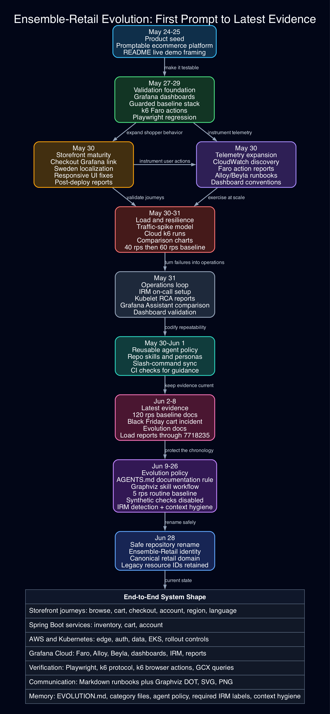

# Ensemble-Retail Evolution

This file summarizes how Ensemble-Retail evolved from the original Ensemble-Grafana promptable training repository into the latest operational state in this repo.

The repository does not contain a literal transcript of every user prompt. This chronology is reconstructed from auditable project evidence: git commit subjects, dated reports, README and runbook updates, Graphviz assets, load-test history, policy and skill changes, and operational artifacts committed through June 9, 2026.

## At A Glance

For dark-background docs, slides, or Grafana-style presentation surfaces, use the dark timeline export: [docs/evolution/diagrams/ensemble-evolution-timeline-dark.png](docs/evolution/diagrams/ensemble-evolution-timeline-dark.png).

- Full evolution package: [docs/evolution/README.md](docs/evolution/README.md)
- High-resolution PNG: [docs/evolution/diagrams/ensemble-evolution-timeline.png](docs/evolution/diagrams/ensemble-evolution-timeline.png)
- Dark high-resolution PNG: [docs/evolution/diagrams/ensemble-evolution-timeline-dark.png](docs/evolution/diagrams/ensemble-evolution-timeline-dark.png)
- SVG source export: [docs/evolution/diagrams/ensemble-evolution-timeline.svg](docs/evolution/diagrams/ensemble-evolution-timeline.svg)
- Dark SVG export: [docs/evolution/diagrams/ensemble-evolution-timeline-dark.svg](docs/evolution/diagrams/ensemble-evolution-timeline-dark.svg)
- Graphviz DOT source: [docs/evolution/diagrams/ensemble-evolution-timeline.dot](docs/evolution/diagrams/ensemble-evolution-timeline.dot)
- Dark Graphviz DOT source: [docs/evolution/diagrams/ensemble-evolution-timeline-dark.dot](docs/evolution/diagrams/ensemble-evolution-timeline-dark.dot)
- Grafana dashboard tab: [Ensemble Graphviz Diagrams / Evolution](https://orenlion.grafana.net/d/ensemble-graphviz-diagrams/ensemble-graphviz-diagrams)

## Prompt Categories

The evolution is easiest to read as a set of prompt categories. Each category links to a deeper timeline with representative prompts, source-backed milestones, and the artifacts that prove the work happened.

| Category | Evolution file | What changed |
| --- | --- | --- |
| Product seed and framing | [product-seed.md](docs/evolution/categories/product-seed.md) | The repo became a promptable ecommerce training platform with a live mock storefront. |
| Application and storefront | [application-storefront.md](docs/evolution/categories/application-storefront.md) | The frontend, checkout, account, localization, and browser regression surfaces matured. |
| Infrastructure and deployment | [infrastructure-deployment.md](docs/evolution/categories/infrastructure-deployment.md) | Terraform, AWS, EKS, Kubernetes rollout rules, secrets, WAF, and deployment docs formed the operating base. |
| Observability and telemetry | [observability-telemetry.md](docs/evolution/categories/observability-telemetry.md) | Grafana Cloud, Faro, Alloy, Beyla, dashboards, user-action reporting, and telemetry validation became core project behavior. |
| Load testing and resilience | [load-testing-resilience.md](docs/evolution/categories/load-testing-resilience.md) | k6 API and browser load tests evolved into repeatable traffic-spike exercises and comparison reporting. |
| Incidents and operations | [incidents-operations.md](docs/evolution/categories/incidents-operations.md) | IRM incidents, RCA reports, on-call setup, kubelet investigations, and operational reports were added. |
| Diagrams and communication | [diagrams-communication.md](docs/evolution/categories/diagrams-communication.md) | Graphviz diagrams, dashboard inventory, and presentation-ready visual assets made the system easier to explain. |
| Agent skills and automation | [agent-skills-automation.md](docs/evolution/categories/agent-skills-automation.md) | Repo-local skills, personas, slash-command sync, and CI checks turned lessons into reusable operating policy. |

## Chronology

### May 24-25, 2026: Seed the Platform

The project started as a promptable training repo and quickly gained its durable frame: an outdoor-inspired ecommerce storefront, three Spring Boot services, AWS deployment assets, and Grafana observability configuration.

Representative prompt category:

> Build a promptable ecommerce training application that can demonstrate frontend, API, deployment, and observability workflows end to end.

Key evidence:

- `7ba5307` and `39b5092`: initial repository and ecommerce observability platform commits.
- `33e5f67`: README explicitly documented the repo as a promptable training exercise.
- `8fdb77d`: CI moved to Node 22 for frontend builds.
- `c801411`: README invited readers to try the live mock storefront.

### May 27-29, 2026: Connect Dashboards, Guards, and Regression Paths

The repo moved from a static application toward operational validation. Grafana dashboard artifacts appeared, account baseline controls were guarded, k6 browser actions were added, and Playwright storefront regression tests entered the workflow.

Representative prompt categories:

> Save and manage the Grafana dashboard assets.

> Make frontend and API behavior testable with browser and k6 validation.

> Move sensitive infrastructure controls into a guarded baseline stack.

Key evidence:

- `bac6d52`: saved Grafana dashboard artifact.
- `0503f1c`: k6 load tests began covering Faro browser actions.
- `cd5a7df`: SSM account controls moved into a guarded baseline stack.
- `0e7f845`: Playwright storefront regression tests were added.
- `857e906`: frontend deploys required k6 browser validation.

### May 30, 2026: Operational Build-Out Day

May 30 was the largest single-day expansion. The project added stronger AWS and Grafana wiring, checkout polish, Sweden localization, region-localization skills, Graphviz traffic-spike diagrams, incident artifacts, frontend validation reports, and multiple k6 traffic-spike tuning passes.

Representative prompt categories:

> Add another storefront region and make sure observability, tests, and docs follow it.

> Visualize traffic-spike behavior with Graphviz and publish the diagrams.

> Tune the traffic-spike load test until the run data is useful and documented.

Key evidence:

- `6d163c0` and `7a0857e`: RDS CloudWatch scrape job and Grafana CloudWatch discovery tags.
- `bb32405`: Sweden storefront localization.
- `3e74a9b` and `4bd9007`: region localization skill and placeholder incident guidance.
- `bf69040`, `3c8201b`, and `49eb585`: Graphviz traffic-spike diagrams and updates.
- `62cadf0`: passing traffic-spike load-test report recorded.

### May 31, 2026: Make Operations Repeatable

The repo hardened the operational model: dashboard inventory rules, Grafana MCP validation, GitHub push requirements for skill changes, kubelet log investigation reports, IRM on-call docs, dashboard color standardization, inventory scaling, and passing 40 rps traffic-spike evidence.

Representative prompt categories:

> Turn dashboard and incident work into repeatable operating practice.

> Investigate kubelet errors and compare the local plan with Grafana Assistant.

> Stabilize services and storefront layout under load and browser checks.

Key evidence:

- `f8d67aa`: Grafana diagram dashboard inventory.
- `45efb0e`: Grafana MCP dashboard validation requirement.
- `c76bd07`: GitHub push required for skill and agent updates.
- `16ddb4b` and `f0f85c7`: kubelet investigation reports.
- `9ddee30`: SRE IRM on-call setup.
- `c99e3b4`: passing 40 rps traffic-spike run recorded.
- `247db68` and `5fce55e`: hero headline clipping fix and regression stabilization.

### June 1-2, 2026: Generate, Sync, and Raise Baselines

The project shifted from one-off testing to generated manifests and repeatable reporting. The k6 scripted check manifest came from one source, slash commands were synchronized between Codex and Cursor, load-test reports were refreshed across multiple runs, the traffic-spike target moved to 120 rps, and a Black Friday cart-add incident was recorded.

Representative prompt categories:

> Generate validation manifests from a single k6 source.

> Keep Codex and Cursor operational commands synchronized.

> Raise the traffic-spike baseline and document the outcome.

Key evidence:

- `0cfc1bd`: generated scripted check manifest from one k6 source.
- `899353b`: sync-slash-commands skill added.
- `6daf6d7`: traffic-spike load raised to 120 rps.
- `f80bced`: Black Friday cart-add incident recorded.
- `c35442f`: load-test docs aligned with the 120 rps baseline.

### June 3-8, 2026: Latest Load-Test Evidence and Evolution Publishing

The latest visible evolution is continued load-test reporting plus the first committed evolution package. New run artifacts were committed on June 3, June 4, and June 8, preserving the current Grafana/k6 evidence trail. The project also gained a dedicated evolution narrative, category files, and a high-resolution Graphviz timeline so people can understand how Ensemble-Grafana was built end to end.

Representative prompt categories:

> Preserve the latest k6/Grafana run data and keep comparison reports current.

> Explain how Ensemble-Grafana was built from first prompt to current state, with category files and a Graphviz timeline.

Key evidence:

- `d8d320c`: load-test report for run `7673849`.
- `bdc102d`: load-test report for run `7683642`.
- `b5273e4`: load-test report for run `7716954`.
- `a44cebe`: evolution docs, category files, DOT source, SVG export, and high-resolution PNG timeline were added.
- `60de963`: load-test report for run `7718235`, the latest load-test evidence in this reconstructed chronology.

### June 9, 2026: Make Evolution Tracking a Policy

The project added explicit agent guidance so future key changes update the evolution story instead of letting the chronology drift. This turns `EVOLUTION.md` from a one-time retrospective into a maintained project artifact.

Representative prompt category:

> Keep the evolution history current whenever key project, policy, skill, diagram, CI, load-test, or operational milestones land.

Key evidence:

- `AGENTS.md`: required documentation rules now call out `EVOLUTION.md`, matching category files, and evolution timeline regeneration.
- `skills/graphviz/SKILL.md`: Graphviz workflow now includes evolution-history diagrams and the `docs/evolution/diagrams/` DOT/SVG/high-resolution PNG export set.
- `docs/evolution/categories/agent-skills-automation.md`: agent policy and skill guidance now records evolution tracking as part of the repo operating model.
- `docs/graphviz/grafana-dashboard-diagram-inventory.md` and `observability/grafana/dashboards/ensemble-graphviz-diagrams-api.json`: the dark evolution timeline is published to the `Evolution` tab of the Grafana dashboard `Ensemble Graphviz Diagrams`, and future evolution timeline updates must push that tab.

### June 11, 2026: Dial the Steady Load Baseline Back to 100 rps

After repeated 120 rps traffic-spike runs were preserved, the default steady API request-rate scenario was lowered to 100 rps. The traffic-spike VU shape remains `100/200/400`, but the constant-arrival-rate protocol baseline now targets 100 requests/second so routine validation keeps production pressure lower while browser/Faro action coverage stays in the combined benchmark.

Representative prompt category:

> Tune the standard traffic-spike benchmark to a lower routine operating baseline.

Key evidence:

- `load-tests/grafana-cloud-traffic-spikes.js`: `API_REQUEST_RPS` now defaults to `100`.
- `README.md`, `.codex/commands/run-load-test.md`, and `skills/observability/SKILLS.md`: operational guidance now documents the 100 rps baseline.
- `DIAGRAMS.md`, `docs/diagrams/`, `docs/graphviz/`, and `docs/evolution/diagrams/`: current diagrams now describe the 100 rps load-test baseline.

### June 18, 2026: Require Detection Labels On Incidents

Incident creation policy now treats detection source as required operational context. The generated incident script emits `detection=manual` by default, and callers can override `DETECTION` for incidents discovered by Synthetic Monitoring, Grafana alerts, k6 load tests, customer reports, call-ins, or another approved taxonomy value.

Representative prompt category:

> Make incident records capture how the problem was detected, not just where it happened and which service or feature was affected.

Key evidence:

- `scripts/generate-incident.sh`: generated incident payloads now include a `detection` label, controlled by the `DETECTION` environment variable.
- `skills/observability/incident-creation/SKILL.md`: the required incident labels are now `region`, `feature`, `service`, and `detection`.
- `docs/grafana-irm.md` and `README.md`: IRM runbook and deployment docs now document the required detection label, default generated value, and `call-in` source.

### June 18, 2026: Add Agent Context Hygiene

After token-growth analysis showed that large tool outputs were driving prompt size more than assistant responses, the repo added explicit context hygiene rules and a Codex session audit utility. The policy now treats oversized tool results as an operational risk for cost, latency, and context-window pressure.

Representative prompt category:

> Keep agent context bounded by capping tool output, avoiding broad session searches, and summarizing large results instead of replaying raw output.

Key evidence:

- `AGENTS.md`: context hygiene now requires narrow reads, explicit output caps, scoped searches, and summary-first handling for large tool results.
- `skills/tooling/context-hygiene/SKILL.md`: reusable guidance now covers token-growth investigations, dangerous broad searches, and the remediation pattern for oversized outputs.
- `scripts/audit-codex-token-context.mjs`: Codex JSONL session logs can now be audited for input-token growth, cached-input share, largest tool outputs, and largest serialized messages.
- `docs/evolution/categories/agent-skills-automation.md`: agent policy chronology now records context hygiene as part of the reusable operating model.

### June 26, 2026: Reduce Validation Cost

The routine steady API request-rate baseline was lowered again, from 100 rps to 5 rps, so the default traffic-spike profile remains useful for script and telemetry validation without generating routine production pressure. Synthetic Monitoring code and manifests remain in the repo, but the live `ensemble-grafana-*` checks are disabled by default to stop ongoing Grafana Cloud check execution cost.

Representative prompt category:

> Preserve validation coverage as code while reducing routine cloud execution cost.

Key evidence:

- `load-tests/grafana-cloud-traffic-spikes.js`: `API_REQUEST_RPS` now defaults to `5`, with the steady request-rate VU pool reduced to `5/20`.
- `observability/synthetic-monitoring/`: Synthetic Monitoring check manifests and the Terraform wrapper now set `enabled: false` while keeping the scripted and browser-check code.
- `README.md`, `.codex/commands/run-load-test.md`, and `skills/observability/SKILLS.md`: operational guidance now documents the 5 rps baseline and disabled Synthetic Monitoring posture.
- `DIAGRAMS.md`, `docs/diagrams/`, `docs/graphviz/`, and `docs/evolution/diagrams/`: current diagrams now describe the 5 rps load-test baseline.

### June 28, 2026: Rename the Repository to Ensemble-Retail

The project-facing identity, GitHub repository, package metadata, test source names, workflow references, current documentation, and canonical domain moved from Ensemble-Grafana to Ensemble-Retail. The migration deliberately preserves existing AWS, Kubernetes, Cognito, Grafana, IRM, and Terraform identifiers that would otherwise require resource recreation or disrupt telemetry continuity.

Representative prompt category:

> Rename the repository and application safely while retaining deployed legacy resource identifiers.

Key evidence:

- `frontend/package.json`, Faro initialization, k6 run metadata, and renamed `ensemble-retail` test sources now use the current project identity.
- `.github/workflows/build.yml`, repo-local skills, and runbooks reference the renamed source files and canonical `https://ensemble-retail.com` domain.
- `README.md` documents the legacy-resource boundary explicitly; Terraform defaults, the `ensemble-grafana` Kubernetes namespace, Cognito domain, Synthetic Monitoring job names, and IRM resource names remain unchanged.
- `DIAGRAMS.md`, `docs/diagrams/`, and the evolution timeline record the canonical-domain and repository identity transition.

## End-to-End Shape

The project now reads as an end-to-end operational application:

1. A Vite storefront creates real user journeys: browsing, cart, checkout, account, region, and language actions.
2. Spring Boot services own inventory, cart, and account data boundaries.
3. Terraform and Kubernetes define AWS, EKS, edge, auth, data, workload, and rollout behavior.
4. Grafana Cloud, Faro, Alloy, Beyla, dashboards, IRM, and reports observe the system.
5. k6 and Playwright validate both protocol and browser behavior, with the routine traffic-spike steady API baseline currently set to 5 rps and Synthetic Monitoring checks preserved as disabled code by default.
6. Graphviz diagrams and dashboard panels explain request paths, telemetry paths, load models, and now project evolution.
7. `EVOLUTION.md` and `docs/evolution/categories/` preserve the build chronology by prompt category.
8. Repo-local skills, personas, and `AGENTS.md` preserve the working rules so future prompts can reproduce the same quality bar, including the boundary between the Ensemble-Retail identity and retained `ensemble-grafana` infrastructure identifiers.

## Verification Notes

- The repository rename updates canonical-domain labels but does not change the underlying architecture, request flow, telemetry flow, network boundaries, or retained deployed resource identifiers.
- The high-resolution image was generated from Graphviz DOT and committed with the DOT and SVG sources under `docs/evolution/diagrams/`.
