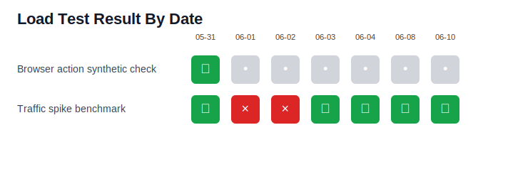
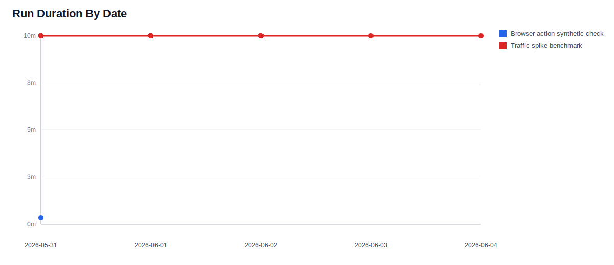
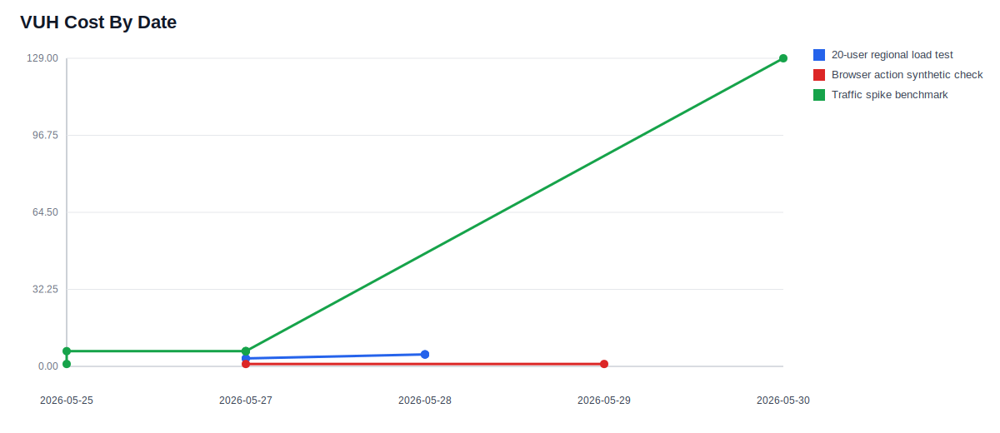
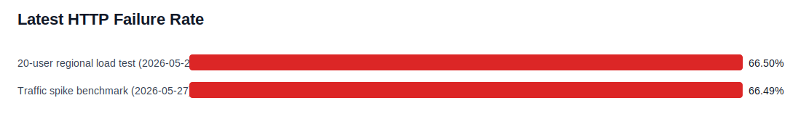
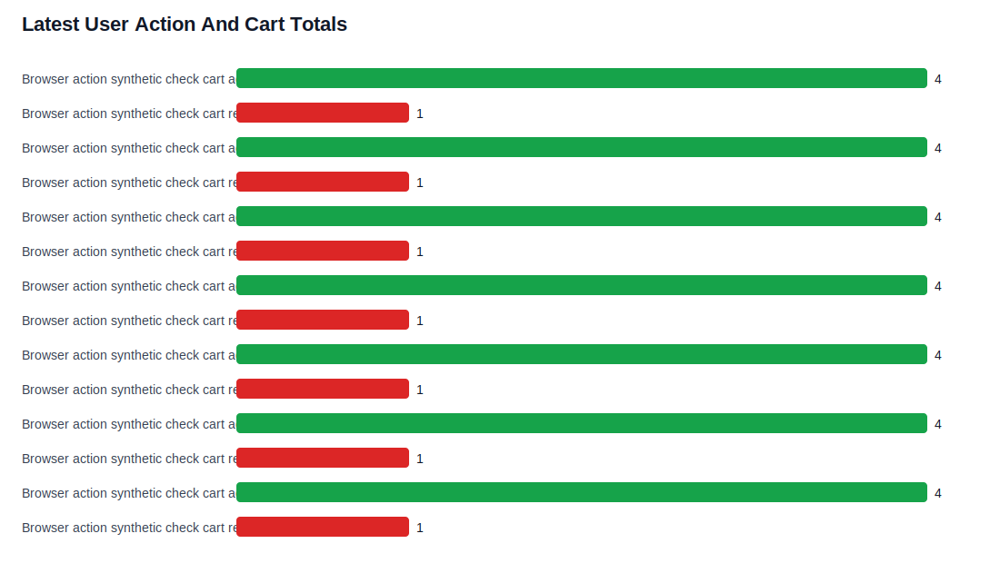

# k6 Load Test Comparison

Generated: 2026-06-02T15:30:16.190Z

Source summary: `reports/load-tests/k6-summary-20260602T152958Z.json`

Source run history: `reports/load-tests/k6-runs-20260602T152958Z.json`

Source Faro action totals: `reports/frontend-user-actions/faro-user-action-totals-20260602T153007Z.json`

## Latest Runs

| Test ID | Test | Latest Run | Date | Result | Duration | HTTP Requests | HTTP Failure Rate | HTTP p95 | Check Pass Rate |
|---:|---|---|---|---:|---:|---:|---:|---:|---:|
| 1228494 | API flow load test | n/a | n/a | n/a | n/a | n/a | n/a | n/a | k6 API 404 for /cloud/v6/load_tests/1228494/test_runs?%24top=20&%24orderby=created+desc: {"error":{"message":"Resource matching query does not exist: '1228494'","code":"error"}} |
| 1228490 | 20-user regional load test | n/a | n/a | n/a | n/a | n/a | n/a | n/a | k6 API 404 for /cloud/v6/load_tests/1228490/test_runs?%24top=20&%24orderby=created+desc: {"error":{"message":"Resource matching query does not exist: '1228490'","code":"error"}} |
| 1228496 | Traffic spike benchmark | [7666228](https://orenlion.grafana.net/a/k6-app/runs/7666228) | 06/02/2026, 11:14 | ✅ | 10.0m | n/a | n/a | n/a | n/a |
| 1233226 | Browser action synthetic check | [7652683](https://orenlion.grafana.net/a/k6-app/runs/7652683) | 05/31/2026, 12:41 | ✅ | 0.3m | n/a | n/a | n/a | n/a |

## Visual Comparison

### Result By Date

### Duration By Date

### VUH Cost By Date

### Latest HTTP Failure Rate

### Latest Check Pass Rate

### Latest HTTP p95

### Latest User Action And Cart Totals

## Result Summary

| Test | Runs | Passed | Failed | Errors | Pass Rate |
|---|---:|---:|---:|---:|---:|
| Browser action synthetic check | 1 | 1 | 0 | 0 | 100.00% |
| Traffic spike benchmark | 20 | 13 | 6 | 1 | 65.00% |

## Request And User Action Totals

These totals come from local k6 summary files named `reports/load-tests/k6-local-summary-*.json`. Cloud run history still provides total HTTP requests for latest runs, but per-action counters such as shopping cart add/remove require these local summaries or equivalent exported metric data.

| Date | Generated | Test | HTTP Requests | HTTP Failures | HTTP Failure Rate | User Actions | Cart Adds Total | Add Item | Add Detail | Add Sale | Remove Item | Checkout | API Cart Updates | Checkout Attempts | Region Changes |
|---|---|---|---:|---:|---:|---:|---:|---:|---:|---:|---:|---:|---:|---:|---:|
| 2026-06-01 | 06/01/2026, 12:05 | Browser action synthetic check | 123 | 14 | 11.38% | 43 | 4 | 1 | 2 | 1 | 1 | 1 | n/a | n/a | n/a |
| 2026-05-31 | 05/31/2026, 19:30 | Browser action synthetic check | 140 | 14 | 10.00% | 43 | 4 | 1 | 2 | 1 | 1 | 1 | n/a | n/a | n/a |
| 2026-05-31 | 05/31/2026, 19:26 | Browser action synthetic check | 218 | 0 | 0.00% | 43 | 4 | 1 | 2 | 1 | 1 | 1 | n/a | n/a | n/a |
| 2026-05-31 | 05/31/2026, 12:40 | Browser action synthetic check | 140 | 14 | 10.00% | 43 | 4 | 1 | 2 | 1 | 1 | 1 | n/a | n/a | n/a |
| 2026-05-31 | 05/31/2026, 12:39 | Browser action synthetic check | 213 | 0 | 0.00% | 43 | 4 | 1 | 2 | 1 | 1 | 1 | n/a | n/a | n/a |
| 2026-05-31 | 05/31/2026, 12:38 | Browser action synthetic check | 86 | 6 | 6.98% | n/a | n/a | n/a | n/a | n/a | n/a | n/a | n/a | n/a | n/a |
| 2026-05-30 | 05/30/2026, 16:54 | Browser action synthetic check | 123 | 14 | 11.38% | 31 | 4 | 1 | 2 | 1 | 1 | 1 | n/a | n/a | n/a |
| 2026-05-30 | 05/30/2026, 16:18 | Browser action synthetic check | 135 | 14 | 10.37% | 31 | 4 | 1 | 2 | 1 | 1 | 1 | n/a | n/a | n/a |
| 2026-05-30 | 05/30/2026, 15:31 | Browser action synthetic check | 135 | 14 | 10.37% | 31 | 4 | 1 | 2 | 1 | 1 | 1 | n/a | n/a | n/a |
| 2026-05-30 | 05/30/2026, 15:28 | Browser action synthetic check | 202 | 0 | 0.00% | 31 | 4 | 1 | 2 | 1 | 1 | 1 | n/a | n/a | n/a |
| 2026-05-30 | 05/30/2026, 15:23 | Browser action synthetic check | 135 | 14 | 10.37% | 31 | 4 | 1 | 2 | 1 | 1 | 1 | n/a | n/a | n/a |
| 2026-05-30 | 05/30/2026, 15:20 | Browser action synthetic check | 202 | 0 | 0.00% | 31 | 4 | 1 | 2 | 1 | 1 | 1 | n/a | n/a | n/a |
| 2026-05-30 | 05/30/2026, 15:20 | Browser action synthetic check | n/a | n/a | n/a | n/a | n/a | n/a | n/a | n/a | n/a | n/a | n/a | n/a | n/a |
| 2026-05-30 | 05/30/2026, 15:19 | Browser action synthetic check | 135 | 14 | 10.37% | 31 | 4 | 1 | 2 | 1 | 1 | 1 | n/a | n/a | n/a |
| 2026-05-30 | 05/30/2026, 14:43 | Browser action synthetic check | 202 | 0 | 0.00% | 31 | 4 | 1 | 2 | 1 | 1 | 1 | n/a | n/a | n/a |
| 2026-05-30 | 05/30/2026, 14:34 | Browser action synthetic check | 202 | 0 | 0.00% | 31 | 4 | 1 | 2 | 1 | 1 | 1 | n/a | n/a | n/a |
| 2026-05-30 | 05/30/2026, 14:29 | Combined traffic spike, regional, and browser-action benchmark | 174425 | 2617 | 1.50% | 31 | 4 | 1 | 2 | 1 | 1 | 1 | 6174 | 1377 | 11586 |
| 2026-05-30 | 05/30/2026, 10:58 | Browser action synthetic check | 135 | 14 | 10.37% | 31 | 4 | 1 | 2 | 1 | 1 | 1 | n/a | n/a | n/a |

## Grafana Faro User Action Executions

These totals come from the latest `gcx logs query` output under `reports/frontend-user-actions/faro-user-action-totals-*.json`. They use the latest sample from a rolling `6h` `count_over_time` query to show what Grafana Cloud received after k6 browser-action runs.

Total executions: 10525

| Action | Importance | Severity | Executions |
|---|---|---|---:|
| search-products | normal | unset | 547 |
| close-product-detail:mens-midlayer-grid | normal | unset | 518 |
| select-language:american-english | normal | unset | 518 |
| select-language:swedish | normal | unset | 518 |
| shopping-cart:add-detail-item:mens-midlayer-grid | normal | unset | 518 |
| sort-products:price-low | normal | unset | 401 |
| navigate-brand-family:ensemble | normal | unset | 259 |
| navigate-brand-family:outlet | normal | unset | 259 |
| navigate-brand-family:regear | normal | unset | 259 |
| navigate-brand-family:trail-lab | normal | unset | 259 |
| navigate-header:account | normal | unset | 259 |
| navigate-header:cart | normal | unset | 259 |
| navigate-header:shop | normal | unset | 259 |
| navigate-hero:shop-new-arrivals | normal | unset | 259 |
| navigate-sale:shop-all | normal | unset | 259 |
| navigate-sale:spring-collection-sale | normal | unset | 259 |
| navigate-utility:find-store | normal | unset | 259 |
| navigate-utility:help | normal | unset | 259 |
| select-category:mens-mid-layers | normal | unset | 259 |
| select-department:mens | normal | unset | 259 |
| select-department:womens | normal | unset | 259 |
| select-region:se | normal | unset | 259 |
| select-region:us | normal | unset | 259 |
| shopping-cart:add-item:mens-midlayer-grid | normal | unset | 259 |
| shopping-cart:add-sale-item:mens-midlayer-grid | normal | unset | 259 |
| shopping-cart:change-quantity:mens-midlayer-grid | normal | unset | 259 |
| shopping-cart:checkout | critical | unset | 259 |
| view-product:product-grid-mens-midlayer-grid | normal | unset | 259 |
| view-product:sale-grid-mens-midlayer-grid | normal | unset | 259 |
| checkout-dialog:close | normal | unset | 258 |
| edit-account-email | normal | unset | 258 |
| edit-account-name | normal | unset | 258 |
| edit-shipping-address | normal | unset | 258 |
| save-account | critical | unset | 258 |
| shopping-cart:remove-item:mens-midlayer-grid | normal | unset | 258 |

## Run History

| Date | Started | Test | Run | Result | Duration | Request/sec | Total VUH | Protocol VUH | Browser VUH |
|---|---|---|---|---:|---:|---:|---:|---:|---:|
| 2026-06-02 | 06/02/2026, 11:14 | Traffic spike benchmark | [7666228](https://orenlion.grafana.net/a/k6-app/runs/7666228) | ✅ | 10.0m | 120 | 108.01 | 99.82 | 8.19 |
| 2026-06-02 | 06/02/2026, 10:35 | Traffic spike benchmark | [7666017](https://orenlion.grafana.net/a/k6-app/runs/7666017) | ✅ | 10.0m | 100 | 102.68 | 94.39 | 8.29 |
| 2026-06-01 | 06/01/2026, 16:21 | Traffic spike benchmark | [7660460](https://orenlion.grafana.net/a/k6-app/runs/7660460) | ❌ | 10.0m | 100 | 102.68 | 94.39 | 8.29 |
| 2026-06-01 | 06/01/2026, 15:54 | Traffic spike benchmark | [7660241](https://orenlion.grafana.net/a/k6-app/runs/7660241) | ✅ | 10.0m | 100 | 102.68 | 94.39 | 8.29 |
| 2026-06-01 | 06/01/2026, 15:23 | Traffic spike benchmark | [7660054](https://orenlion.grafana.net/a/k6-app/runs/7660054) | ✅ | 10.0m | 100 | 102.68 | 94.39 | 8.29 |
| 2026-06-01 | 06/01/2026, 14:38 | Traffic spike benchmark | [7659799](https://orenlion.grafana.net/a/k6-app/runs/7659799) | ❌ | 10.0m | 120 | 108.01 | 99.82 | 8.19 |
| 2026-06-01 | 06/01/2026, 14:23 | Traffic spike benchmark | [7659741](https://orenlion.grafana.net/a/k6-app/runs/7659741) | ✅ | 10.0m | 100 | 102.68 | 94.39 | 8.29 |
| 2026-06-01 | 06/01/2026, 14:04 | Traffic spike benchmark | [7659609](https://orenlion.grafana.net/a/k6-app/runs/7659609) | ✅ | 10.0m | 80 | 96.68 | 88.34 | 8.34 |
| 2026-06-01 | 06/01/2026, 11:34 | Traffic spike benchmark | [7658832](https://orenlion.grafana.net/a/k6-app/runs/7658832) | ✅ | 10.0m | 60 | 90.84 | 82.50 | 8.34 |
| 2026-06-01 | 06/01/2026, 10:10 | Traffic spike benchmark | [7658257](https://orenlion.grafana.net/a/k6-app/runs/7658257) | ✅ | 10.0m | 70 | 90.84 | 82.50 | 8.34 |
| 2026-06-01 | 06/01/2026, 09:47 | Traffic spike benchmark | [7658132](https://orenlion.grafana.net/a/k6-app/runs/7658132) | ✅ | 10.0m | 60 | 90.84 | 82.50 | 8.34 |
| 2026-06-01 | 06/01/2026, 08:25 | Traffic spike benchmark | [7657705](https://orenlion.grafana.net/a/k6-app/runs/7657705) | ✅ | 10.0m | 60 | 90.84 | 82.50 | 8.34 |
| 2026-05-31 | 05/31/2026, 19:40 | Traffic spike benchmark | [7654225](https://orenlion.grafana.net/a/k6-app/runs/7654225) | ✅ | 10.0m | 60 | 90.84 | 82.50 | 8.34 |
| 2026-05-31 | 05/31/2026, 18:44 | Traffic spike benchmark | [7654030](https://orenlion.grafana.net/a/k6-app/runs/7654030) | ✅ | 10.0m | 60 | 90.84 | 82.50 | 8.34 |
| 2026-05-31 | 05/31/2026, 18:28 | Traffic spike benchmark | [7653979](https://orenlion.grafana.net/a/k6-app/runs/7653979) | ❌ | 10.0m | 60 | 90.84 | 82.50 | 8.34 |
| 2026-05-31 | 05/31/2026, 18:04 | Traffic spike benchmark | [7653899](https://orenlion.grafana.net/a/k6-app/runs/7653899) | ❌ | 10.0m | 60 | 90.84 | 82.50 | 8.34 |
| 2026-05-31 | 05/31/2026, 17:43 | Traffic spike benchmark | [7653800](https://orenlion.grafana.net/a/k6-app/runs/7653800) | ❌ | 10.0m | 60 | 90.84 | 82.50 | 8.34 |
| 2026-05-31 | 05/31/2026, 17:16 | Traffic spike benchmark | [7653715](https://orenlion.grafana.net/a/k6-app/runs/7653715) | ✅ | 10.0m | 40 | 90.84 | 82.50 | 8.34 |
| 2026-05-31 | 05/31/2026, 17:14 | Traffic spike benchmark | [7653705](https://orenlion.grafana.net/a/k6-app/runs/7653705) | ⚠️ | 0.8m | 40 | 7.19 | 6.19 | 1.00 |
| 2026-05-31 | 05/31/2026, 16:52 | Traffic spike benchmark | [7653610](https://orenlion.grafana.net/a/k6-app/runs/7653610) | ❌ | 10.0m | 30 | 90.84 | 82.50 | 8.34 |
| 2026-05-31 | 05/31/2026, 12:41 | Browser action synthetic check | [7652683](https://orenlion.grafana.net/a/k6-app/runs/7652683) | ✅ | 0.3m | 0 | 1.00 | 0.00 | 1.00 |

## Machine-Readable Comparison

- CSV: [comparison/load-test-runs.csv](comparison/load-test-runs.csv)
- Counter CSV: [comparison/load-test-counters.csv](comparison/load-test-counters.csv)
- SVG charts are stored under [comparison/](comparison/).
