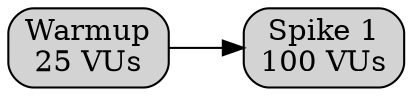

# Graphviz Diagram

Use this skill when creating or updating Graphviz diagrams.

## Required Inputs

Infer these from the request when possible:

- Diagram purpose, such as traffic spike stage model, service dependency flow, or request path.
- Source data, such as k6 stages, service list, or architecture notes.
- Output location. Default to `docs/graphviz/`.
- Output formats. Default to `.dot` and `.svg`; add `.png` when requested.

## Workflow

1. Confirm Graphviz is installed:

```sh
dot -V
```

If `dot` is missing and the host supports Homebrew:

```sh
brew install graphviz
dot -V
```

2. Create or update the DOT source under `docs/graphviz/`.

Use simple DOT IDs and put display text in labels:



3. Render and store generated assets in the repo:

```sh
dot -Tsvg docs/graphviz/<name>.dot > docs/graphviz/<name>.svg
dot -Tpng docs/graphviz/<name>.dot > docs/graphviz/<name>.png
```

4. Validate outputs:

```sh
dot -Tsvg docs/graphviz/<name>.dot > /tmp/<name>.svg
xmllint --noout docs/graphviz/<name>.svg
file docs/graphviz/<name>.png
```

5. If the diagram is intended for Grafana, add or update a dashboard panel:

- Prefer the Grafana Graphviz panel when `grafana-graphviz-panel` is enabled.
- Use Graphviz Code mode for static DOT.
- Use Query mode only when a datasource returns a DataFrame with a DOT column.
- For metrics panels next to the diagram, use datasource `grafanacloud-orenlion-prom`.
- If Graphviz is not enabled, use the Infinity datasource or a standard text/table panel as a fallback.

6. Update documentation:

- README for user-facing commands and dashboard links.
- DIAGRAMS.md when architecture, request flow, telemetry flow, or operational dependencies change.
- `docs/graphviz/README.md` when adding reusable diagram conventions.

7. Commit and push when the user asks to store or publish the graph:

```sh
git status --short
git add docs/graphviz README.md DIAGRAMS.md skills/graphviz/SKILL.md
git commit -m "Add Graphviz <diagram-purpose> diagram"
git push
```

8. After pushing, poll GitHub Actions:

```sh
gh run list --branch main --limit 5
gh run watch <run-id> --exit-status
```

If CI fails, inspect the failed logs, fix, commit, push, and repeat until the pushed commit has a passing run.

## Traffic Spike Diagram Pattern

For k6 traffic spike models, show:

- Recovery/warmup stages.
- Spike 1, Spike 2, and Spike 3 target VUs.
- Expected requests per completed wave.
- Expected cart updates, checkout attempts, and region changes per completed wave.
- A note that actual totals depend on response time, sleep time, and iteration completion rate.

Default labels for the current Ensemble traffic spike script:

```text
25 -> 100 -> 100 -> 25 -> 200 -> 200 -> 25 -> 400 -> 400 -> 0
```

Use live Grafana/k6 metrics beside the graph when available rather than pretending the static model is measured telemetry.
